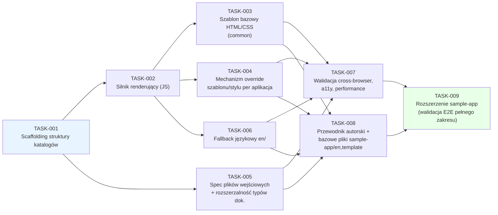

# Plan pracy — Ujednolicenie dokumentów App Store Connect (ASCDocs)

## Przegląd
Celem przyrostu jest zbudowanie ujednoliconej, w pełni statycznej struktury i mechanizmu renderowania
(HTML/CSS/JS w przeglądarce, bez logiki serwerowej) do przygotowywania dokumentów wymaganych przez
App Store Connect (Privacy Policy, Terms of Use, Support i inne specyficzne dla aplikacji) dla wielu
aplikacji i wielu wersji językowych, ze wspólnym szablonem bazowym i możliwością nadpisania go/jego
stylu per aplikacja. Źródło: `docs/dev/requirements/index.md` i `docs/dev/requirements/appstore-docs.md`
(REQ-001–REQ-016).

## Macierz traceability (REQ → TASK)

| REQ-XXX | TASK-YYY |
|---------|----------|
| REQ-001 | TASK-001, TASK-002 |
| REQ-002 | TASK-001 |
| REQ-003 | TASK-002, TASK-005 |
| REQ-004 | TASK-002, TASK-003 |
| REQ-005 | TASK-002, TASK-004 |
| REQ-006 | TASK-002, TASK-003 |
| REQ-007 | TASK-004 |
| REQ-008 | TASK-005 |
| REQ-009 | TASK-001, TASK-006 |
| REQ-010 | TASK-006 |
| REQ-011 | TASK-007 |
| REQ-012 | TASK-008 |
| REQ-013 | TASK-008 |
| REQ-014 | TASK-003, TASK-007 |
| REQ-015 | TASK-003, TASK-007 |
| REQ-016 | TASK-003, TASK-007 |
| REQ-017 | TASK-002, TASK-004 |

## Spis grup zadań

| Grupa (plik) | Zakres TASK-XXX | Opis |
|--------------|-----------------|------|
| [`plan/appstore-docs.md`](appstore-docs.md) | TASK-001–TASK-009 | Struktura katalogów, silnik renderujący (vanilla JS, bez zależności do dodatkowych bibliotek — REQ-017), szablon bazowy, mechanizm override (szablon/styl), spec plików wejściowych, fallback językowy, walidacja cross-browser, dokumentacja procesu + bazowe pliki `sample-app`, rozszerzenie `sample-app` do pełnej referencyjnej aplikacji QA. |

## Definition of Done — poziom przyrostu (release-level)

- [x] Wszystkie zadania `TASK-001`–`TASK-009` mają status `Done` (zob. `docs/dev/log.md`, LOG-001–LOG-005).
- [x] Referencyjna aplikacja przykładowa (`content/sample-app/`, bazowe pliki z TASK-008,
      rozszerzenie w TASK-009) renderuje poprawnie wszystkie 3 typy dokumentów w `en` i co najmniej
      jednym drugim języku (`de/`), z demonstracją fallbacku (REQ-010) na trzecim, brakującym
      języku (`pl/support.html`, wygenerowany przez `npm run fallback:languages`).
- [x] Renderowanie zweryfikowane bez błędów konsoli/wizualnych na Chromium/WebKit/Firefox (3 z 4
      silników macierzy REQ-011 — automatyzowalne w Playwright). **Częściowo otwarte:** mobile
      Safari (iOS)/Chrome (Android) na rzeczywistych urządzeniach wymaga manualnej weryfikacji
      przed pierwszą produkcyjną publikacją (niewykonalne w środowisku sandboxowym tej sesji —
      zob. LOG-003/LOG-005).
- [x] Automatyczna kontrola dostępności (axe-core) nie zgłasza naruszeń poziomu A/AA (REQ-014) —
      0 naruszeń na wszystkich 3 typach dokumentów, na wszystkich 3 automatyzowanych silnikach.
- [~] Audyt Lighthouse (mobile) w progu "dobry" dla LCP/INP/CLS (REQ-016) — surowe metryki (bez
      throttlingu) doskonałe (LCP 0.2s, CLS 0, TBT 0ms, wynik 1.0); wynik z symulowanym mobilnym
      throttlingiem w sandboxie deweloperskim był niereprezentatywny (LCP 8.0s, wynik 0.58) z
      powodu ograniczeń tego środowiska wykonawczego — wymaga powtórzenia na docelowej
      infrastrukturze hostingowej przed produkcyjną publikacją (zob. LOG-003).
- [x] Dokument `docs/authoring-guide.md` (REQ-013) opublikowany, pokrywa wszystkie 5 punktów z
      odwołaniem do realnych ścieżek `content/sample-app/`.
- [x] `docs/readme.md` zaktualizowany o stan rejestrów po zakończeniu przyrostu.
- [x] Brak regresji: pełny zestaw testów (Vitest 17/17, `node:test` 6/6, Playwright 42/42) zielony
      po każdym kroku implementacji.
- [x] Brak zależności do dodatkowych bibliotek JS w kodzie produkcyjnym (REQ-017) — weryfikacja: przegląd
      wszystkich plików `content/**/*.html` i `content/common/js/`, `content/<app-name>/template/*.js`
      nie ujawnia odwołań (`<script src="...">`, `import`) do zewnętrznych bibliotek/frameworków JS;
      ewentualne `package.json` w repozytorium zawiera wyłącznie zależności deweloperskie/testowe
      (Vitest, Playwright, axe-core, Lighthouse CI), nigdy zależności runtime ładowane w przeglądarce.

## Strategia testowania — przegląd ogólny

Trzy uzupełniające się poziomy, dobrane pod kątem statycznego, w pełni klienckiego renderowania (bez
backendu do testowania integracyjnego API):
1. **Jednostkowe (JS)** — logika silnika renderującego (rozwiązywanie szablonu: bazowy vs. override
   aplikacji; kompozycja DOM; logika fallbacku językowego) testowana w izolacji za pomocą frameworka
   testów JS działającego w środowisku przeglądarkopodobnym (np. Vitest + `happy-dom`/`jsdom`), bez
   uruchamiania prawdziwej przeglądarki.
2. **End-to-end w przeglądarce** — otwarcie realnych plików wejściowych (`privacy-policy.html` itd.)
   serwowanych przez lokalny serwer statyczny i weryfikacja finalnego, wyrenderowanego DOM (obecność
   nagłówka/stopki/treści, poprawność szablonu override, poprawność fallbacku językowego) za pomocą
   Playwright, uruchamianego na silnikach Chromium, WebKit i Firefox (pokrycie całej macierzy REQ-011
   bez potrzeby fizycznych urządzeń dla przypadków automatyzowalnych).
3. **Manualne cross-browser + accessibility + performance** — manualna weryfikacja na rzeczywistym
   mobile Safari (iOS) i Chrome (Android), automatyczny audyt axe-core (dostępność, REQ-014) i
   Lighthouse (wydajność, REQ-016) uruchamiane na zbudowanej stronie referencyjnej.

Każde zadanie w `plan/appstore-docs.md` precyzuje, który z powyższych poziomów stosuje i jakie jest
kryterium przejścia (test gate wchodzący w skład jego Definition of Done).

## Diagram zależności/kolejności

Ścieżka krytyczna: `TASK-001 → TASK-002 → (TASK-003/004/005/006 równolegle) → TASK-007 → TASK-009`.
`TASK-008` (dokumentacja + bazowe pliki `sample-app`) może przebiegać równolegle do `TASK-007`, ale
musi zakończyć się przed `TASK-009`, ponieważ `TASK-009` rozszerza tę samą, jedną aplikację
`sample-app` utworzoną w `TASK-008` (nie tworzy równoległej, drugiej aplikacji przykładowej) i
dodatkowo waliduje użyteczność dokumentacji.

## Log decyzji i eskalacji

| # | Spór/decyzja | Stanowiska | Rozstrzygnięcie | Uzasadnienie |
|---|--------------|-----------|------------------|--------------|
| 1 | Zachowanie przy braku tłumaczenia dla danego języka aplikacji | Requirements Analyst zaproponował 3 warianty (fallback do en / 404 / lista dostępnych języków) | Eskalowane do użytkownika (2026-08-10) → **fallback do en** | Wybór użytkownika; zapewnia zawsze dostępną treść prawną/wsparcia. Wpłynęło na REQ-010 i TASK-006. |
| 2 | Macierz wspieranych przeglądarek | Web Frontend Software Architect zaproponował 3 warianty (evergreen / szersze wsparcie legacy / własna macierz) | Eskalowane do użytkownika (2026-08-10) → **evergreen, bez IE/legacy** | Wybór użytkownika; pozwala używać natywnych ES modules/Custom Elements/Fetch bez polyfilli. Wpłynęło na REQ-011 i TASK-007. |
| 3 | Mechanizm techniczny fallbacku językowego (build-time copy vs. runtime redirect w JS) | Web Frontend Software Architect rozważył oba warianty w TASK-006 | **Build-time/publish-time generowanie kopii pliku `en/` pod brakującą ścieżką języka**, zamiast wykrywania błędu ładowania w runtime JS | Statyczny hosting bez logiki serwerowej (REQ-001) i ograniczenia `fetch()` na `file://` czynią rozwiązanie runtime kruchym/niejednoznacznym (trudne do niezawodnego wykrycia braku pliku bez dodatkowego żądania sieciowego, które i tak wymaga hostingu HTTP); podejście build-time jest przewidywalne, testowalne jednostkowo i nie wymaga zmian w silniku renderującym w przeglądarce. Brak sporu z użytkownikiem — decyzja czysto techniczna udokumentowana dla przejrzystości. |
| 4 | Zakres zależności JS dopuszczalnych w projekcie | — | **Brak zależności do dodatkowych bibliotek JS w kodzie produkcyjnym** (REQ-017); narzędzia deweloperskie/testowe (Vitest, Playwright, axe-core, Lighthouse CI z TASK-002/007) pozostają dopuszczalne, ponieważ nie trafiają do przeglądarki użytkownika końcowego | Jawne żądanie użytkownika (2026-08-10). Potwierdza i zaostrza wcześniejszą decyzję architektoniczną z TASK-002 (wybór vanilla JS zamiast frameworka) — teraz jako twarde wymaganie, nie tylko preferencję architekta. |
| 5 | Czy przykładowe pliki dla dokumentacji (żądanie użytkownika: aplikacja "Example") mają być osobną, nową aplikacją, czy scalone z istniejącą aplikacją referencyjną TASK-009 | Zaproponowano 2 warianty: (a) scalić z `sample-app` z TASK-009, (b) osobny, niezależny zestaw plików tylko dla TASK-008 | Eskalowane do użytkownika (2026-08-10) → **scalić — pozostaje tylko wcześniej zaplanowana `sample-app`**, bez tworzenia osobnej aplikacji "Example" | Wybór użytkownika; unika duplikacji dwóch równoległych aplikacji przykładowych. TASK-008 rozszerzony o tworzenie bazowych plików `sample-app/en/` i `sample-app/template/`, do których odwołuje się `docs/authoring-guide.md`; TASK-009 rozszerza tę samą aplikację o pełny zakres (dodatkowe języki, fallback, pełny override) na potrzeby walidacji QA. |
