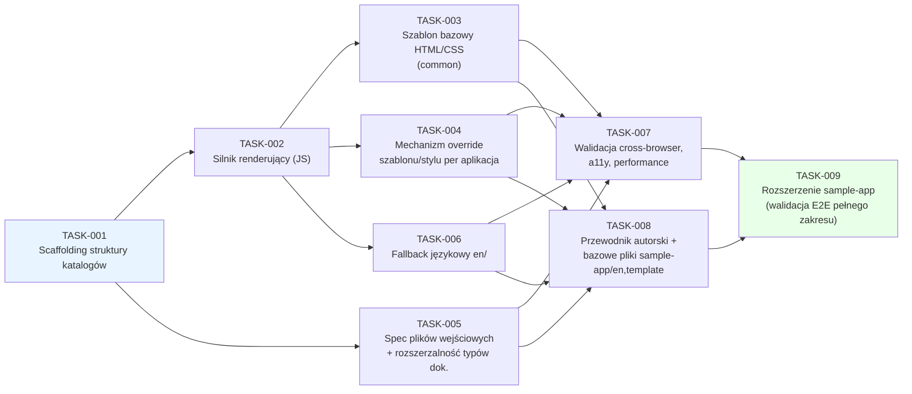
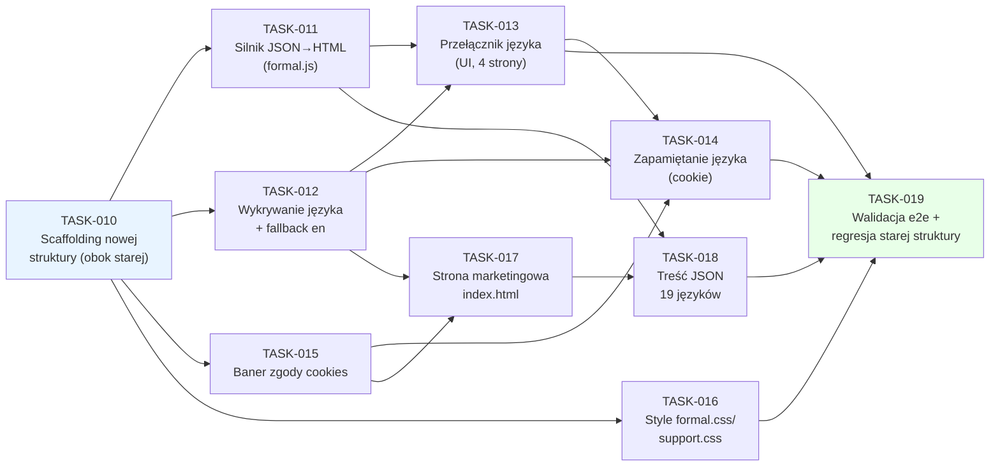
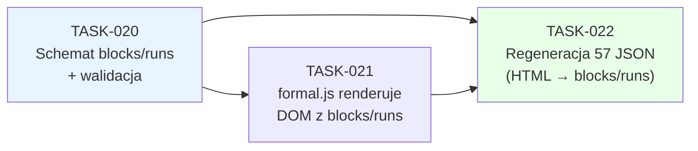

# Plan pracy — Ujednolicenie dokumentów App Store Connect (ASCDocs)

## Przegląd
Celem przyrostu jest zbudowanie ujednoliconej, w pełni statycznej struktury i mechanizmu renderowania
(HTML/CSS/JS w przeglądarce, bez logiki serwerowej) do przygotowywania dokumentów wymaganych przez
App Store Connect (Privacy Policy, Terms of Use, Support i inne specyficzne dla aplikacji) dla wielu
aplikacji i wielu wersji językowych, ze wspólnym szablonem bazowym i możliwością nadpisania go/jego
stylu per aplikacja. Źródło: `docs/dev/requirements/index.md` i `docs/dev/requirements/appstore-docs.md`
(REQ-001–REQ-016).

**Dodatek (2026-09-07):** grupa `bike-pilot` (TASK-010–TASK-019) wprowadza dla aplikacji bike-pilot
pilotaż nowej, równoległej architektury opartej o `docs/dev/requirements/ideas.md` — jeden szablon
HTML per typ dokumentu formalnego (zamiast pliku per język), treść ładowana z JSON per język,
wykrywanie/przełącznik/trwałe zapamiętanie języka (cookie) oraz klauzula zgody na cookies, a także
nowa strona marketingowa. Przyrost jest dodawany **obok** istniejącej struktury
`content/bike-pilot/<lang>/*.html` (REQ-002/REQ-003), bez jej modyfikacji, i ograniczony wyłącznie do
`content/bike-pilot/` — bez zmian w `content/common/`. Źródło:
`docs/dev/requirements/index.md` i `docs/dev/requirements/bike-pilot.md` (REQ-018–REQ-025).

## Macierz traceability (REQ → TASK)

| REQ-XXX | TASK-YYY |
|---------|----------|
| REQ-001 | TASK-001, TASK-002 |
| REQ-002 | TASK-001 |
| REQ-003 | TASK-002, TASK-005 |
| REQ-004 | TASK-002, TASK-003 |
| REQ-005 | TASK-002, TASK-004 |
| REQ-006 | TASK-002, TASK-003 |
| REQ-007 | TASK-004 |
| REQ-008 | TASK-005 |
| REQ-009 | TASK-001, TASK-006 |
| REQ-010 | TASK-006 |
| REQ-011 | TASK-007 |
| REQ-012 | TASK-008 |
| REQ-013 | TASK-008 |
| REQ-014 | TASK-003, TASK-007 |
| REQ-015 | TASK-003, TASK-007 |
| REQ-016 | TASK-003, TASK-007 |
| REQ-017 | TASK-002, TASK-004 |
| REQ-018 | TASK-010, TASK-011, TASK-018, TASK-019 |
| REQ-019 | TASK-011, TASK-012, TASK-018, TASK-019 |
| REQ-020 | TASK-011, TASK-013, TASK-019 |
| REQ-021 | TASK-014, TASK-019 |
| REQ-022 | TASK-015, TASK-019 |
| REQ-023 | TASK-016, TASK-019 |
| REQ-024 | TASK-017, TASK-019 |
| REQ-025 | TASK-017, TASK-018, TASK-019 |
| REQ-026 | TASK-020, TASK-021, TASK-022 |

## Spis grup zadań

| Grupa (plik) | Zakres TASK-XXX | Opis |
|--------------|-----------------|------|
| [`plan/appstore-docs.md`](appstore-docs.md) | TASK-001–TASK-009 | Struktura katalogów, silnik renderujący (vanilla JS, bez zależności do dodatkowych bibliotek — REQ-017), szablon bazowy, mechanizm override (szablon/styl), spec plików wejściowych, fallback językowy, walidacja cross-browser, dokumentacja procesu + bazowe pliki `sample-app`, rozszerzenie `sample-app` do pełnej referencyjnej aplikacji QA. |
| [`plan/bike-pilot.md`](bike-pilot.md) | TASK-010–TASK-022 | Pilotaż nowej architektury JSON+szablon dla bike-pilot: scaffolding nowej struktury równoległej, silnik JSON→HTML, wykrywanie/przełącznik/zapamiętanie języka (cookie), baner zgody, style formalne, strona marketingowa, treść JSON dla 19 języków, walidacja e2e + regresja starej struktury; TASK-020–TASK-022 (dodatek) zastępują format treści formalnej JSON (HTML → model blocks/runs bez znaczników, REQ-026). |

## Definition of Done — poziom przyrostu (release-level)

- [x] Wszystkie zadania `TASK-001`–`TASK-009` mają status `Done` (zob. `docs/dev/log.md`, LOG-001–LOG-005).
- [x] Referencyjna aplikacja przykładowa (`content/sample-app/`, bazowe pliki z TASK-008,
      rozszerzenie w TASK-009) renderuje poprawnie wszystkie 3 typy dokumentów w `en` i co najmniej
      jednym drugim języku (`de/`), z demonstracją fallbacku (REQ-010) na trzecim, brakującym
      języku (`pl/support.html`, wygenerowany przez `npm run fallback:languages`).
- [x] Renderowanie zweryfikowane bez błędów konsoli/wizualnych na Chromium/WebKit/Firefox (3 z 4
      silników macierzy REQ-011 — automatyzowalne w Playwright). **Częściowo otwarte:** mobile
      Safari (iOS)/Chrome (Android) na rzeczywistych urządzeniach wymaga manualnej weryfikacji
      przed pierwszą produkcyjną publikacją (niewykonalne w środowisku sandboxowym tej sesji —
      zob. LOG-003/LOG-005).
- [x] Automatyczna kontrola dostępności (axe-core) nie zgłasza naruszeń poziomu A/AA (REQ-014) —
      0 naruszeń na wszystkich 3 typach dokumentów, na wszystkich 3 automatyzowanych silnikach.
- [~] Audyt Lighthouse (mobile) w progu "dobry" dla LCP/INP/CLS (REQ-016) — surowe metryki (bez
      throttlingu) doskonałe (LCP 0.2s, CLS 0, TBT 0ms, wynik 1.0); wynik z symulowanym mobilnym
      throttlingiem w sandboxie deweloperskim był niereprezentatywny (LCP 8.0s, wynik 0.58) z
      powodu ograniczeń tego środowiska wykonawczego — wymaga powtórzenia na docelowej
      infrastrukturze hostingowej przed produkcyjną publikacją (zob. LOG-003).
- [x] Dokument `docs/authoring-guide.md` (REQ-013) opublikowany, pokrywa wszystkie 5 punktów z
      odwołaniem do realnych ścieżek `content/sample-app/`.
- [x] `docs/readme.md` zaktualizowany o stan rejestrów po zakończeniu przyrostu.
- [x] Brak regresji: pełny zestaw testów (Vitest 17/17, `node:test` 6/6, Playwright 42/42) zielony
      po każdym kroku implementacji.
- [x] Brak zależności do dodatkowych bibliotek JS w kodzie produkcyjnym (REQ-017) — weryfikacja: przegląd
      wszystkich plików `content/**/*.html` i `content/common/js/`, `content/<app-name>/template/*.js`
      nie ujawnia odwołań (`<script src="...">`, `import`) do zewnętrznych bibliotek/frameworków JS;
      ewentualne `package.json` w repozytorium zawiera wyłącznie zależności deweloperskie/testowe
      (Vitest, Playwright, axe-core, Lighthouse CI), nigdy zależności runtime ładowane w przeglądarce.

### DoD — grupa `bike-pilot` (dodatek 2026-09-07, przed implementacją)

- [ ] Wszystkie zadania `TASK-010`–`TASK-019` mają status `Done`.
- [ ] Zero zmian w istniejących plikach `content/bike-pilot/<lang>/*.html` (19 języków × 3 dokumenty) —
      weryfikacja `git diff` pusta na tych ścieżkach.
- [ ] Nowa struktura `content/bike-pilot/{privacy-policy,terms-of-use,support,index}.html` +
      `css/js/formal/img/media/content` renderuje poprawnie wszystkie 4 strony w każdym z 19 języków,
      bez błędów konsoli (Chromium/WebKit/Firefox).
- [ ] Wykrywanie, przełącznik i trwałe zapamiętanie (cookie) języka działają zgodnie z REQ-019/020/021
      na wszystkich 4 stronach.
- [ ] Baner zgody na cookies (REQ-022) wyświetla się raz, obejmuje wszystkie 4 strony, blokuje zapis
      cookie językowego przed zgodą.
- [ ] Automatyczna kontrola dostępności (axe-core) nie zgłasza naruszeń A/AA na żadnej z 4 nowych stron.
- [ ] `content/common/` pozostaje niezmienione (zakres ograniczony do `content/bike-pilot/`).
- [ ] `docs/readme.md` zaktualizowany o stan grupy `bike-pilot` po zakończeniu implementacji.

### DoD — dodatek `bike-pilot` TASK-020–TASK-022 (2026-09-07, przed implementacją)

- [ ] Wszystkie zadania `TASK-020`–`TASK-022` mają status `Done`.
- [ ] Żaden z 57 plików `content/bike-pilot/formal/<typ>/<lang>.json` nie zawiera pola `html` ani
      znaczników HTML — wyłącznie model `blocks[]`/`runs[]` zgodny z REQ-026.
- [ ] `js/formal.js` renderuje treść wyłącznie przez DOM API (`createElement`/`textContent`), bez
      `innerHTML` dla treści per język.
- [ ] Brak regresji tekstowej/strukturalnej względem stanu sprzed zmiany (57/57 plików) oraz w
      testach e2e (TASK-019, rozszerzone).

## Strategia testowania — przegląd ogólny

Trzy uzupełniające się poziomy, dobrane pod kątem statycznego, w pełni klienckiego renderowania (bez
backendu do testowania integracyjnego API):
1. **Jednostkowe (JS)** — logika silnika renderującego (rozwiązywanie szablonu: bazowy vs. override
   aplikacji; kompozycja DOM; logika fallbacku językowego) testowana w izolacji za pomocą frameworka
   testów JS działającego w środowisku przeglądarkopodobnym (np. Vitest + `happy-dom`/`jsdom`), bez
   uruchamiania prawdziwej przeglądarki.
2. **End-to-end w przeglądarce** — otwarcie realnych plików wejściowych (`privacy-policy.html` itd.)
   serwowanych przez lokalny serwer statyczny i weryfikacja finalnego, wyrenderowanego DOM (obecność
   nagłówka/stopki/treści, poprawność szablonu override, poprawność fallbacku językowego) za pomocą
   Playwright, uruchamianego na silnikach Chromium, WebKit i Firefox (pokrycie całej macierzy REQ-011
   bez potrzeby fizycznych urządzeń dla przypadków automatyzowalnych).
3. **Manualne cross-browser + accessibility + performance** — manualna weryfikacja na rzeczywistym
   mobile Safari (iOS) i Chrome (Android), automatyczny audyt axe-core (dostępność, REQ-014) i
   Lighthouse (wydajność, REQ-016) uruchamiane na zbudowanej stronie referencyjnej.

Każde zadanie w `plan/appstore-docs.md` precyzuje, który z powyższych poziomów stosuje i jakie jest
kryterium przejścia (test gate wchodzący w skład jego Definition of Done).

### Strategia testowania — grupa `bike-pilot` (dodatek 2026-09-07)

Reużywa tę samą infrastrukturę (Vitest + `happy-dom`, Playwright na Chromium/WebKit/Firefox,
axe-core) rozszerzoną o: (1) jednostkowe testy logiki i18n (`js/language.js` — dopasowanie języka,
cookie) z mockiem `navigator`/`document.cookie`; (2) e2e dla 4 nowych stron × 19 języków (renderowanie,
przełącznik, trwałość wyboru, baner zgody); (3) test regresji potwierdzający brak zmian w
zachowaniu/treści istniejących 57 plików `content/bike-pilot/<lang>/*.html`. Szczegóły per zadanie w
`plan/bike-pilot.md`.

## Diagram zależności/kolejności

Ścieżka krytyczna: `TASK-001 → TASK-002 → (TASK-003/004/005/006 równolegle) → TASK-007 → TASK-009`.
`TASK-008` (dokumentacja + bazowe pliki `sample-app`) może przebiegać równolegle do `TASK-007`, ale
musi zakończyć się przed `TASK-009`, ponieważ `TASK-009` rozszerza tę samą, jedną aplikację
`sample-app` utworzoną w `TASK-008` (nie tworzy równoległej, drugiej aplikacji przykładowej) i
dodatkowo waliduje użyteczność dokumentacji.

### Diagram zależności/kolejności — grupa `bike-pilot` (dodatek 2026-09-07)

Ścieżka krytyczna: `TASK-010 → TASK-011/TASK-012 → TASK-013 → TASK-014 → TASK-019` (zapamiętanie
języka wymaga wcześniej przełącznika i banera zgody). `TASK-016` (style) i `TASK-017`+`TASK-018`
(strona marketingowa + treść per język) mogą przebiegać równolegle do gałęzi
`TASK-013→TASK-014`, ale wszystkie muszą zakończyć się przed `TASK-019`.

### Diagram zależności/kolejności — dodatek `bike-pilot` TASK-020–TASK-022 (2026-09-07)

Ścieżka: `TASK-020 → TASK-021 → TASK-022` (regeneracja plików wymaga gotowego schematu i renderera,
by móc od razu zweryfikować równoważność wizualną/tekstową po regeneracji).

## Log decyzji i eskalacji

| # | Spór/decyzja | Stanowiska | Rozstrzygnięcie | Uzasadnienie |
|---|--------------|-----------|------------------|--------------|
| 1 | Zachowanie przy braku tłumaczenia dla danego języka aplikacji | Requirements Analyst zaproponował 3 warianty (fallback do en / 404 / lista dostępnych języków) | Eskalowane do użytkownika (2026-08-10) → **fallback do en** | Wybór użytkownika; zapewnia zawsze dostępną treść prawną/wsparcia. Wpłynęło na REQ-010 i TASK-006. |
| 2 | Macierz wspieranych przeglądarek | Web Frontend Software Architect zaproponował 3 warianty (evergreen / szersze wsparcie legacy / własna macierz) | Eskalowane do użytkownika (2026-08-10) → **evergreen, bez IE/legacy** | Wybór użytkownika; pozwala używać natywnych ES modules/Custom Elements/Fetch bez polyfilli. Wpłynęło na REQ-011 i TASK-007. |
| 3 | Mechanizm techniczny fallbacku językowego (build-time copy vs. runtime redirect w JS) | Web Frontend Software Architect rozważył oba warianty w TASK-006 | **Build-time/publish-time generowanie kopii pliku `en/` pod brakującą ścieżką języka**, zamiast wykrywania błędu ładowania w runtime JS | Statyczny hosting bez logiki serwerowej (REQ-001) i ograniczenia `fetch()` na `file://` czynią rozwiązanie runtime kruchym/niejednoznacznym (trudne do niezawodnego wykrycia braku pliku bez dodatkowego żądania sieciowego, które i tak wymaga hostingu HTTP); podejście build-time jest przewidywalne, testowalne jednostkowo i nie wymaga zmian w silniku renderującym w przeglądarce. Brak sporu z użytkownikiem — decyzja czysto techniczna udokumentowana dla przejrzystości. |
| 4 | Zakres zależności JS dopuszczalnych w projekcie | — | **Brak zależności do dodatkowych bibliotek JS w kodzie produkcyjnym** (REQ-017); narzędzia deweloperskie/testowe (Vitest, Playwright, axe-core, Lighthouse CI z TASK-002/007) pozostają dopuszczalne, ponieważ nie trafiają do przeglądarki użytkownika końcowego | Jawne żądanie użytkownika (2026-08-10). Potwierdza i zaostrza wcześniejszą decyzję architektoniczną z TASK-002 (wybór vanilla JS zamiast frameworka) — teraz jako twarde wymaganie, nie tylko preferencję architekta. |
| 5 | Czy przykładowe pliki dla dokumentacji (żądanie użytkownika: aplikacja "Example") mają być osobną, nową aplikacją, czy scalone z istniejącą aplikacją referencyjną TASK-009 | Zaproponowano 2 warianty: (a) scalić z `sample-app` z TASK-009, (b) osobny, niezależny zestaw plików tylko dla TASK-008 | Eskalowane do użytkownika (2026-08-10) → **scalić — pozostaje tylko wcześniej zaplanowana `sample-app`**, bez tworzenia osobnej aplikacji "Example" | Wybór użytkownika; unika duplikacji dwóch równoległych aplikacji przykładowych. TASK-008 rozszerzony o tworzenie bazowych plików `sample-app/en/` i `sample-app/template/`, do których odwołuje się `docs/authoring-guide.md`; TASK-009 rozszerza tę samą aplikację o pełny zakres (dodatkowe języki, fallback, pełny override) na potrzeby walidacji QA. |
| 6 | (grupa `bike-pilot`) Relacja nowej architektury (`ideas.md`) do istniejącej struktury `content/bike-pilot/<lang>/*.html` | Zaproponowano 2 warianty: (a) dodać nowe pliki obok istniejących, bez ich ruszania, (b) zmigrować treść istniejących plików do JSON i zastąpić punkty wejścia nowymi szablonami | Eskalowane do użytkownika (2026-09-07) → **dodać obok** — stare pliki pozostają nienaruszone i niepodpięte pod nowy silnik | Wybór użytkownika; zero ryzyka regresji na już wykorzystywanych przez App Store Connect adresach URL. Wpłynęło na REQ-018 i TASK-010. |
| 7 | (grupa `bike-pilot`) Zakres pierwszego przyrostu nowej architektury | Zaproponowano 2 warianty: (a) tylko `content/bike-pilot/` (pilotaż), (b) silnik trafia od razu do `content/common/` jako rozszerzenie współdzielone | Eskalowane do użytkownika (2026-09-07) → **tylko `content/bike-pilot/`**, bez zmian w `content/common/` | Wybór użytkownika; ogranicza ryzyko przyrostu do jednej aplikacji przed ewentualnym uogólnieniem. Wpłynęło na podejście techniczne TASK-011/TASK-012 (moduły lokalne dla bike-pilot, nie w `content/common/js/`). |
| 8 | (grupa `bike-pilot`) Co zrobić z istniejącym prototypem `content/bike-pilot/en/merketing/` (strona marketingowa bez i18n) | Zaproponowano 2 warianty: (a) przebudować go na nową strukturę, (b) zignorować i zbudować `index.html` od zera wg `ideas.md` | Eskalowane do użytkownika (2026-09-07) → **zignorować** — prototyp pozostaje bez zmian i nieużywany | Wybór użytkownika; unika komplikacji migracji ad-hoc prototypu (literówka w nazwie, brak i18n) i pozwala zbudować stronę marketingową zgodnie ze strukturą wskazaną wprost w `ideas.md` (`index.html` w korzeniu `content/bike-pilot/`). Wpłynęło na REQ-024/REQ-025 i TASK-017. |
| 9 | (grupa `bike-pilot`) Mechanizm trwałości wyboru języka — cookie czy Web Storage | `ideas.md` dopuszczał oba ("cookies/webstorage") | Eskalowane do użytkownika (2026-09-07) → **cookie** | Wybór użytkownika; świadomie aktywuje wymóg klauzuli informacyjnej o cookies (REQ-022) zgodnie z warunkową regułą z `ideas.md` pkt 5 ("Jesli uzywamy cookies..."). Wpłynęło na REQ-021/TASK-014. |
| 10 | (grupa `bike-pilot`) Zakres klauzuli zgody na cookies — tylko strona marketingowa czy wszystkie strony bike-pilot | Zaproponowano 2 warianty: (a) tylko `index.html`, (b) wszystkie 4 strony (formalne + marketingowa) | Eskalowane do użytkownika (2026-09-07) → **wszystkie strony** | Wybór użytkownika; spójne z tym, że każda z 4 stron może zapisywać cookie wyboru języka (REQ-021), więc każda wymaga poinformowania o tym zgodnie z REQ-022. Wpłynęło na REQ-022/TASK-015. |
| 11 | (grupa `bike-pilot`) Format treści JSON dokumentów formalnych — surowy HTML czy model ustrukturyzowany | Pierwsza implementacja TASK-011/TASK-018 zapisała pole `html` z surowym znacznikami skopiowanymi ze źródła (najprostsze technicznie, ale sprzeczne z celem oddzielenia treści od znaczników) | Użytkownik zgłosił to jawnie po zaimplementowaniu (2026-09-07) → **model blocks/runs bez HTML** (REQ-026) | Wybór użytkownika; TASK-011/TASK-018 pozostają w rejestrze bez zmian (Zasada przyrostowego rejestru), ale ich rezultat (format JSON, sposób renderowania) jest zastępowany przez TASK-020–TASK-022. |
