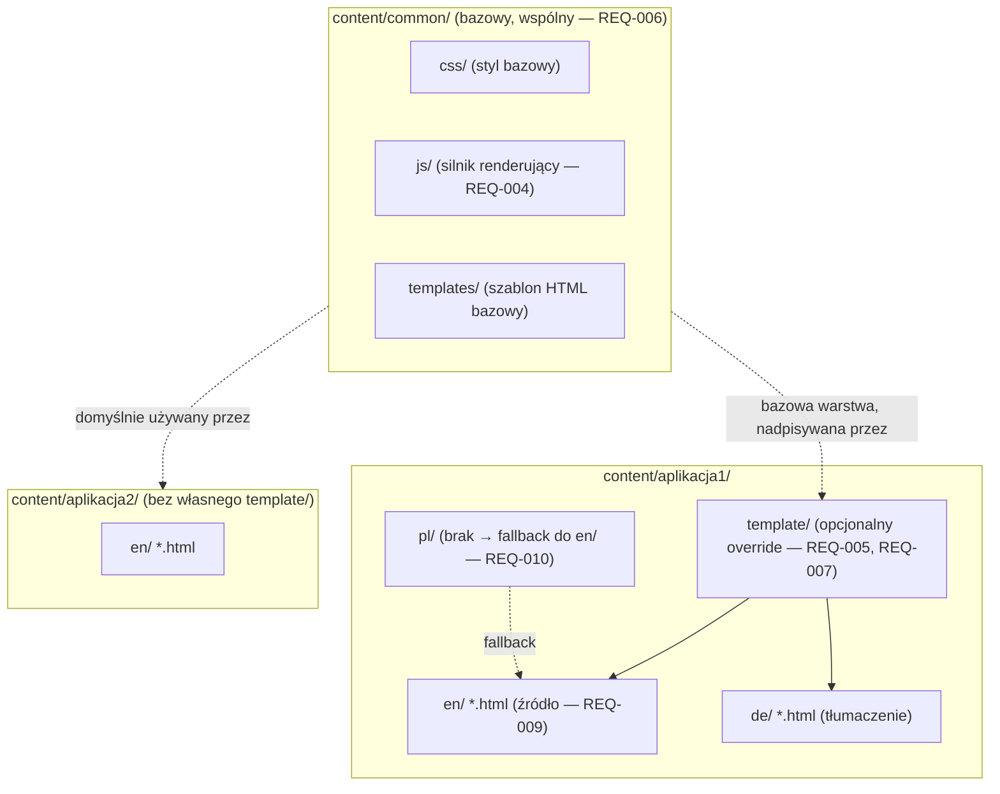
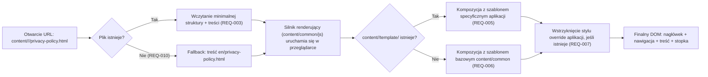

# Rejestr wymagań — grupa: appstore-docs

> Część `docs/dev/requirements/index.md` — patrz tam: changelog, domena projektu, macierz
> przeglądarek, spis grup.

### REQ-001: Wyłącznie statyczna architektura, bez logiki serwerowej
- **Status:** Zaakceptowane
- **Źródło:** "To nie jest aplikacja"; "wszystkie pliki sa statyczne"; "server hostuje tylko statyczne pliki"
- **Opis:** Cały projekt (struktura, treść, style, logika renderowania) składa się wyłącznie z plików
  statycznych (HTML, CSS, JS, obrazy PNG/JPG, wideo). Serwer produkcyjny pełni wyłącznie rolę hostingu
  plików statycznych — brak jakiegokolwiek przetwarzania po stronie serwera (brak backendu, brak
  server-side renderingu, brak kroku build wymaganego do hostowania — pliki źródłowe = pliki
  produkcyjne).
- **Uzasadnienie:** Uproszczenie hostingu (dowolny hosting statyczny), zgodność z charakterem
  dokumentów prawnych/wsparcia dla App Store Connect, minimalizacja kosztów utrzymania.
- **Kryteria akceptacji:** Żaden plik w repozytorium nie wymaga uruchomienia kodu po stronie serwera
  (np. PHP, Node.js jako runtime serwerowy) do poprawnego wyświetlenia treści; cała logika renderowania
  wykonywana jest w przeglądarce klienta.
- **Zależności:** brak
- **Uwagi z researchu:** brak (nie dotyczy warstwy platformy — zasada 6 pomija ten krok dla wymagania
  czysto architektonicznego).

### REQ-002: Ujednolicona struktura katalogów `content/`
- **Status:** Zaakceptowane
- **Źródło:** "content/common: CSS, JS, szablony HTML"; "content/: specyficzne pliki dla kazdej z
  aplikacji w folderach... np. content/aplikacja1"; "specyficzne pliki dla aplikacji w podziale na
  jezyki: content/<app-name>/<lang>"
- **Opis:** Struktura katalogów projektu:
  - `content/common/` — zasoby wspólne dla wszystkich aplikacji (CSS bazowy, JS renderujący, szablony
    HTML bazowe).
  - `content/<app-name>/` — katalog dedykowany jednej aplikacji (nazwa katalogu = identyfikator
    aplikacji).
  - `content/<app-name>/<lang>/` — wersje językowe treści dla danej aplikacji (`<lang>` = kod języka,
    np. `en`, `de`, `pl`).
  - `content/<app-name>/template/` — opcjonalny szablon specyficzny dla aplikacji (zob. REQ-005).
- **Uzasadnienie:** Jasny, przewidywalny podział między treścią współdzieloną a specyficzną dla
  aplikacji/języka, ułatwiający dodawanie nowych aplikacji/języków bez zmian strukturalnych.
- **Kryteria akceptacji:** Dla dowolnej nowej aplikacji dodanie katalogu `content/<app-name>/` wraz z
  podkatalogami języków jest wystarczające do uruchomienia dokumentów tej aplikacji, bez modyfikacji
  `content/common/`.
- **Zależności:** brak
- **Uwagi z researchu:** brak.

### REQ-003: Punkty wejścia — pliki dokumentów per język
- **Status:** Zaakceptowane
- **Źródło:** "Punktem wejscia maja byc pliki: content/<app-name>/<lang>/privacy-policy.html,
  terms-of-use.html, support.html"; "Te pliki powinny zawierac minimalna strukture HTML oraz
  specyficzna zawartosc wynikajaca w jezyka dla tej aplikacji"
- **Opis:** Pliki `privacy-policy.html`, `terms-of-use.html`, `support.html` w
  `content/<app-name>/<lang>/` są bezpośrednimi punktami wejścia — muszą być poprawnie wyświetlane po
  otwarciu ich URL wprost (tak jak linkuje je App Store Connect), bez pośredniego routera/loadera.
  Każdy z tych plików zawiera: minimalną strukturę HTML (deklarację dokumentu, odwołania do wspólnych/
  specyficznych zasobów CSS/JS) oraz właściwą, gotową treść w języku i dla aplikacji, do której należy
  (tekst prawny/wsparcia — nie dane pośrednie w innym formacie, np. JSON).
- **Uzasadnienie:** Zgodność z wymaganiami App Store Connect, które przyjmuje bezpośrednie URL-e do
  poszczególnych dokumentów per aplikacja/język.
- **Kryteria akceptacji:** Otwarcie URL `content/<app-name>/<lang>/privacy-policy.html` (analogicznie
  dla pozostałych dwóch) w obsługiwanej przeglądarce (REQ-011) wyświetla kompletną, poprawnie
  wyrenderowaną stronę bez błędów konsoli.
- **Zależności:** REQ-002, REQ-004
- **Uwagi z researchu:** brak.

### REQ-004: Renderowanie kompozycji strony wyłącznie po stronie klienta (JS)
- **Status:** Zaakceptowane
- **Źródło:** "Renderowanie kontentu ma byc tylko w przegladarce w JS, nic po stronie servera"; "niech
  template bedzie... zestawem plikow (HTML, CSS, JS), ktore wyrenderuja w taki sam sposob dane z
  plikow z wersjami jezykowymi"
- **Opis:** Wspólna warstwa JS (`content/common/`) w czasie ładowania strony pobiera treść zawartą w
  pliku wejściowym (REQ-003) i komponuje wokół niej spójną powłokę wizualną (nagłówek, stopka,
  nawigacja, styl) zgodną z szablonem bazowym lub — jeśli istnieje — szablonem specyficznym dla
  aplikacji (REQ-005). Cały proces kompozycji odbywa się w przeglądarce po załadowaniu dokumentu; brak
  jakiegokolwiek przetwarzania treści po stronie serwera lub w kroku build.
- **Uzasadnienie:** Spójny wygląd (branding wspólny + akcent aplikacji) bez duplikowania kodu
  HTML/CSS/JS w każdym pliku wejściowym.
- **Kryteria akceptacji:** Plik wejściowy zawiera wyłącznie minimalną strukturę + właściwą treść;
  finalny, w pełni wyrenderowany widok (z nagłówkiem/stopką/stylem) powstaje dopiero w DOM po
  wykonaniu skryptu renderującego, weryfikowalne poprzez porównanie initial HTML source vs. rendered
  DOM.
- **Zależności:** REQ-002, REQ-003, REQ-005, REQ-006
- **Uwagi z researchu:** Web Platform Documentation Researcher (2026-08-10, MDN): natywne moduły ES
  (`<script type="module">`) oraz Custom Elements V1 są w pełni wspierane przez wszystkie przeglądarki
  z macierzy REQ-011 (Chrome 61+/63+, Firefox 60+/63+, Safari 11+/13+, Edge 16+/79+) — mogą być
  bezpiecznie użyte jako mechanizm kompozycji szablonu. **Ryzyko:** Fetch API zwraca błąd sieciowy dla
  URL-i `file://` we wszystkich głównych przeglądarkach — mechanizm renderujący **nie może** polegać na
  `fetch()` do pobrania treści z osobnych plików danych przy otwieraniu strony lokalnie z dysku; jest to
  spójne z REQ-003 (treść osadzona bezpośrednio w pliku wejściowym) i REQ-001 (serwer hostuje pliki
  statyczne — w środowisku produkcyjnym adresy są zawsze `http(s)://`, nie `file://`, więc `fetch()`
  pozostaje bezpieczny do pobierania współdzielonych zasobów szablonu, o ile projekt nie musi wspierać
  otwierania plików bezpośrednio z dysku).

### REQ-005: Szablon specyficzny dla aplikacji jako nadpisanie szablonu wspólnego
- **Status:** Zaakceptowane
- **Źródło:** "Te pliki... powinny korzystac z szablonu spacyficznego dla <app-name>:
  content/<app-name>/template... niech template bedzie pojedynczym plikiem lub zestawem plikow (HTML,
  CSS, JS), ktore wyrenderuja w taki sam sposob dane z plikow z wersjami jezykowymi"
- **Opis:** Aplikacja może (opcjonalnie) dostarczyć własny szablon w `content/<app-name>/template/`
  (jeden plik lub zestaw plików HTML/CSS/JS). Jeśli szablon aplikacji istnieje, silnik renderujący
  używa go zamiast (lub jako rozszerzenia — zob. REQ-006) szablonu bazowego z `content/common/`, przy
  zachowaniu identycznego kontraktu renderowania treści językowej, tak by wynik był spójny niezależnie
  od tego, czy aplikacja dostarcza własny szablon, czy korzysta z domyślnego.
- **Uzasadnienie:** Umożliwienie aplikacjom o unikalnym brandingu/UX odejścia od domyślnego wyglądu bez
  duplikowania całej logiki renderującej.
- **Kryteria akceptacji:** Dla aplikacji z katalogiem `content/<app-name>/template/` renderowany wynik
  używa tego szablonu; dla aplikacji bez tego katalogu używany jest szablon bazowy `content/common/`
  bez błędów.
- **Zależności:** REQ-002, REQ-004, REQ-006
- **Uwagi z researchu:** brak.

### REQ-006: Szablon bazowy wspólny dla wszystkich aplikacji (domyślny)
- **Status:** Zaakceptowane
- **Źródło:** "W glownym katalogu content/common maja byc ogolne szablony wspolne dla wszystkich
  aplikacji, zeby zachowac spojnosc stylu"
- **Opis:** `content/common/` zawiera domyślny szablon (HTML/CSS/JS) używany przez każdą aplikację,
  która nie dostarcza własnego szablonu specyficznego (REQ-005). Ten szablon definiuje bazową
  strukturę wizualną (layout, typografię, elementy nawigacyjne) współdzieloną między wszystkimi
  aplikacjami.
- **Uzasadnienie:** Spójność stylu między wszystkimi aplikacjami korzystającymi z rejestru jako baza,
  zanim zostanie ewentualnie nadpisana per aplikacja.
- **Kryteria akceptacji:** Usunięcie/braku katalogu `content/<app-name>/template/` nie powoduje błędu
  renderowania — aplikacja poprawnie wyświetla dokumenty z użyciem wyłącznie `content/common/`.
- **Zależności:** REQ-002
- **Uwagi z researchu:** brak.

### REQ-007: Nadpisywanie stylu specyficznego dla aplikacji (bez duplikacji)
- **Status:** Zaakceptowane
- **Źródło:** "Pozwol na definiowanie specyficznych styli dla kazdej z aplikacji, jako zmiany stylu
  wspolnego, aby nadac charakter aplikacji"
- **Opis:** Mechanizm stylowania musi pozwalać aplikacji na zdefiniowanie własnych, ograniczonych
  nadpisań stylu wspólnego (np. kolorystyka, typografia, logo/akcent), bez konieczności kopiowania
  całego arkusza stylów wspólnego. Styl wspólny pozostaje bazą ładowaną zawsze jako pierwsza warstwa.
- **Uzasadnienie:** Nadanie charakteru/brandingu per aplikacja przy zachowaniu spójności strukturalnej
  i minimalizacji duplikacji kodu CSS (łatwość utrzymania — zob. REQ-012).
- **Kryteria akceptacji:** Zmiana pojedynczej wartości (np. koloru akcentu) dla jednej aplikacji wymaga
  edycji wyłącznie pliku nadpisania specyficznego dla tej aplikacji, bez modyfikacji
  `content/common/`; pozostałe aplikacje nie są tą zmianą dotknięte.
- **Zależności:** REQ-005, REQ-006
- **Uwagi z researchu:** brak (dobór konkretnego mechanizmu — np. CSS custom properties — należy do
  decyzji architektonicznej w planie pracy, Scenariusz 3).

### REQ-008: Rozszerzalność o dodatkowe typy dokumentów
- **Status:** Zaakceptowane
- **Źródło:** "Celem projektu jest ujednolicenie przygotowywanie dokumentow dla AppStore Connect:
  Privacy Policy, Terms of Use (EULA), Support, inne, byc moze specyficzne dla konkretengo projektu"
- **Opis:** Struktura i mechanizm renderowania muszą wspierać dodanie kolejnych typów dokumentów (poza
  Privacy Policy, Terms of Use, Support) dla konkretnej aplikacji, bez zmian w `content/common/` ani w
  strukturze innych aplikacji — poprzez dodanie kolejnego pliku `.html` w
  `content/<app-name>/<lang>/`.
- **Uzasadnienie:** Różne aplikacje mogą wymagać dodatkowych dokumentów specyficznych (np. Marketing
  Disclosure, Subscription Terms) bez potrzeby zmiany rdzenia projektu.
- **Kryteria akceptacji:** Dodanie nowego pliku `content/<app-name>/<lang>/<nowy-dokument>.html`
  zgodnego z konwencją plików wejściowych (REQ-003) renderuje się poprawnie bez zmian w
  `content/common/` lub w plikach innych aplikacji.
- **Zależności:** REQ-002, REQ-003, REQ-004
- **Uwagi z researchu:** brak.

### REQ-009: Angielski jako język bazowy/źródłowy
- **Status:** Zaakceptowane
- **Źródło:** "Zaloz, ze wersja jezykowa podstawowa, to angielska"; "Na podsatwie wersji angielskiej
  beda przygotowywane tlumaczenia"
- **Opis:** Dla każdej aplikacji katalog `content/<app-name>/en/` jest kanoniczną, źródłową wersją
  językową, na podstawie której przygotowywane są tłumaczenia na pozostałe języki. Wersja `en/` musi
  istnieć dla każdej aplikacji i każdego wspieranego typu dokumentu.
- **Uzasadnienie:** Jeden spójny punkt odniesienia dla procesu tłumaczenia i weryfikacji kompletności
  treści.
- **Kryteria akceptacji:** Każda aplikacja posiada kompletny katalog `en/` z wszystkimi wymaganymi
  dokumentami (co najmniej `privacy-policy.html`, `terms-of-use.html`, `support.html`) zanim dodane
  zostaną tłumaczenia na inne języki.
- **Zależności:** REQ-002, REQ-003
- **Uwagi z researchu:** brak.

### REQ-010: Automatyczny fallback do języka angielskiego przy braku tłumaczenia
- **Status:** Zaakceptowane
- **Źródło ustalenia:** Rozstrzygnięcie niejednoznaczności z użytkownikiem (2026-08-10): "Automatyczny
  fallback do wersji angielskiej (en) jako języka podstawowego" — wybrane spośród opcji zaproponowanych
  przez Requirements Analyst, ponieważ draft nie precyzował zachowania przy braku tłumaczenia.
- **Opis:** Jeśli żądany plik `content/<app-name>/<lang>/<dokument>.html` nie istnieje dla danego
  `<lang>`, mechanizm dostępu/renderowania (np. link generowany przez narzędzia projektu, lub sam
  proces publikacji) musi zapewnić, że użytkownik trafi na wersję angielską (`en/`) tego samego
  dokumentu tej samej aplikacji, zamiast błędu 404 lub pustej strony.
- **Uzasadnienie:** Zapewnienie, że dokument prawny/wsparcia jest zawsze dostępny w jakiejś formie,
  nawet przy niekompletnym zestawie tłumaczeń — zgodnie z wyborem użytkownika.
- **Kryteria akceptacji:** Próba otwarcia `content/<app-name>/<lang>/privacy-policy.html` dla `<lang>`
  bez istniejącego pliku skutkuje wyświetleniem treści `content/<app-name>/en/privacy-policy.html`
  (bezpośrednio lub przez jawne przekierowanie), bez błędu 404 dla użytkownika końcowego.
- **Zależności:** REQ-003, REQ-009
- **Uwagi z researchu:** Ponieważ pliki są statyczne i hostowane bez logiki serwerowej (REQ-001),
  mechanizm fallbacku musi być rozstrzygnięty na etapie planu (Scenariusz 3) — np. przez proces
  generowania/kopiowania brakujących plików językowych jako kopii `en/` w czasie przygotowania
  publikacji, ponieważ czysto klientocentryczny fallback (JS przekierowujący po nieudanym
  załadowaniu) wymagałby dodatkowej logiki wykrywania błędu ładowania danego URL, co nie jest trywialne
  bez routingu po stronie serwera. Decyzję techniczną (build-time copy vs. runtime redirect) podejmie
  Web Frontend Software Architect w Scenariuszu 3.

### REQ-011: Macierz wspieranych przeglądarek
- **Status:** Zaakceptowane
- **Źródło ustalenia:** Rozstrzygnięcie niejednoznaczności z użytkownikiem (2026-08-10): "Nowoczesne
  przeglądarki evergreen (ostatnie 2 wersje Chrome/Edge/Firefox/Safari) + aktualny mobile Safari/Chrome
  Android — bez wsparcia IE/legacy". Ustalenie wymagane przez Kontekst domenowy — Domena B workflow.
- **Opis:** Projekt musi poprawnie renderować się i działać (w tym renderowanie JS, REQ-004) w:
  ostatnich 2 wersjach Chrome, Edge, Firefox, Safari (desktop) oraz aktualnych wersjach mobile Safari
  (iOS) i Chrome (Android). Brak wymogu wsparcia przeglądarek starszych/IE.
- **Uzasadnienie:** Świadomie ograniczony zakres wsparcia pozwala używać nowoczesnych, natywnych API
  (ES modules, Custom Elements, Fetch) bez polyfilli, zgodnie z Zasadą "zawsze najlepsze rozwiązanie".
- **Kryteria akceptacji:** Manualna/zautomatyzowana weryfikacja (zob. plan, strategia testowania)
  renderowania wszystkich trzech typów dokumentów w każdej przeglądarce z macierzy nie wykazuje błędów
  wizualnych ani błędów konsoli.
- **Zależności:** REQ-004
- **Uwagi z researchu:** Web Platform Documentation Researcher (2026-08-10, MDN): natywne ES modules,
  Fetch API i Custom Elements V1 są w pełni wspierane przez wszystkie przeglądarki z tej macierzy —
  brak potrzeby polyfilli/transpilacji.

### REQ-012: Minimalistyczna, łatwo edytowalna struktura
- **Status:** Zaakceptowane
- **Źródło:** "Zaproponowana struktura ma byc spojna, prosta, minimalistyczna, latwa do edycji"
- **Opis:** Struktura katalogów i konwencje plików muszą pozwalać osobie edytującej treść (niekoniecznie
  programiście) na dodanie/aktualizację treści dokumentu dla danej aplikacji/języka przy minimalnej
  wiedzy o HTML, bez potrzeby rozumienia mechanizmu renderowania JS.
- **Uzasadnienie:** Częsta czynność (aktualizacja treści prawnej/wsparcia) nie powinna wymagać wiedzy
  technicznej wykraczającej poza podstawowy HTML.
- **Kryteria akceptacji:** Dokumentacja projektu (REQ-013) pozwala nowej osobie dodać treść dla nowego
  języka istniejącej aplikacji, postępując wyłącznie według instrukcji, bez konsultacji z autorami
  mechanizmu renderującego.
- **Zależności:** REQ-002, REQ-013
- **Uwagi z researchu:** brak.

### REQ-013: Dokumentacja procesu przygotowywania treści
- **Status:** Zaakceptowane
- **Źródło:** "Chce miec jasny, klarowny i jednoznaczny dokument, ktory opisuje, jak przygotowywac
  kontent na kazdym z poziomow"
- **Opis:** Musi powstać dokument (np. `docs/authoring-guide.md` lub odpowiednik w `docs/`) opisujący
  jednoznacznie, jak przygotować/zaktualizować treść na każdym poziomie: `content/common/` (zasoby
  wspólne), `content/<app-name>/` (nowa aplikacja), `content/<app-name>/template/` (szablon
  specyficzny), `content/<app-name>/<lang>/` (nowy język/dokument), włącznie z konwencją nazewnictwa i
  wymaganą minimalną strukturą HTML pliku wejściowego.
- **Uzasadnienie:** Jawne żądanie użytkownika o klarowną, jednoznaczną dokumentację procesu.
- **Kryteria akceptacji:** Dokument istnieje, jest kompletny (pokrywa wszystkie 4 poziomy wymienione w
  Opisie) i pozwala wykonać REQ-012 bez dodatkowych pytań.
- **Zależności:** REQ-002, REQ-005, REQ-006, REQ-009
- **Uwagi z researchu:** brak.

### REQ-014: Semantyczny, dostępny HTML (WCAG 2.1/2.2 AA)
- **Status:** Zaakceptowane
- **Źródło:** Domyślne założenie Domeny B workflow ("Semantyczny, dostępny HTML jako priorytet...
  domyślny standard dostępności: WCAG 2.1/2.2 AA"), zastosowane, ponieważ draft nie zawiera wskazań
  przeciwnych, a dokumenty prawne/wsparcia muszą być dostępne dla wszystkich użytkowników App Store.
- **Opis:** Szablon bazowy (REQ-006), ewentualne szablony specyficzne (REQ-005) oraz treść w plikach
  wejściowych muszą używać semantycznego HTML (nagłówki, landmarki, listy) i spełniać WCAG 2.1/2.2 na
  poziomie AA (kontrast, nawigacja klawiaturą, tekst alternatywny dla obrazów/wideo — zob. REQ-002
  wsparcie dla PNG/JPG/wideo).
- **Uzasadnienie:** Domyślna zasada Domeny B; dokumenty prawne i wsparcia powinny być dostępne dla
  wszystkich użytkowników.
- **Kryteria akceptacji:** Automatyczna kontrola dostępności (np. axe-core) na wyrenderowanym DOM nie
  zgłasza naruszeń poziomu A/AA dla żadnego z trzech typów dokumentów.
- **Zależności:** REQ-004, REQ-006
- **Uwagi z researchu:** brak (standard WCAG jest ogólnie znany i stabilny; nie wymaga researchu
  API-specyficznego).

### REQ-015: Responsywność mobile-first
- **Status:** Zaakceptowane
- **Źródło:** Domyślne założenie Domeny B workflow ("Responsywność mobile-first, o ile wymagania nie
  mówią inaczej"), zastosowane wobec braku wskazań przeciwnych w draft.
- **Opis:** Szablon bazowy i style współdzielone projektowane są mobile-first (bazowe style dla
  wąskiego viewportu, progresywne rozszerzenia przez media queries dla szerszych ekranów).
- **Uzasadnienie:** Znaczna część ruchu do dokumentów prawnych/wsparcia z App Store pochodzi z urządzeń
  mobilnych; domyślna zasada Domeny B.
- **Kryteria akceptacji:** Wyrenderowana strona jest w pełni czytelna i użyteczna (bez poziomego
  przewijania, czytelny tekst) przy szerokości viewportu od 320px wzwyż.
- **Zależności:** REQ-006
- **Uwagi z researchu:** brak.

### REQ-016: Wydajność mierzona Core Web Vitals
- **Status:** Zaakceptowane
- **Źródło:** Domyślne założenie Domeny B workflow ("Wydajność mierzona Core Web Vitals (LCP, INP,
  CLS) i Lighthouse"), zastosowane wobec braku wskazań przeciwnych w draft.
- **Opis:** Strony renderowane przez mechanizm z REQ-004 muszą osiągać dobre wyniki Core Web Vitals
  (LCP, INP, CLS) mimo renderowania treści w JS po stronie klienta — np. przez unikanie layout shift
  podczas kompozycji szablonu i minimalizację rozmiaru wspólnego JS/CSS.
- **Uzasadnienie:** Domyślna zasada Domeny B; strony proste treściowo powinny ładować się natychmiastowo
  i bez przeskoków layoutu.
- **Kryteria akceptacji:** Audyt Lighthouse (tryb mobile) dla reprezentatywnego dokumentu wskazuje
  wyniki w progu "dobry" dla LCP, INP i CLS.
- **Zależności:** REQ-004
- **Uwagi z researchu:** brak.

### REQ-017: Brak zależności do dodatkowych bibliotek JS w kodzie produkcyjnym
- **Status:** Zaakceptowane
- **Źródło:** User input: "zadnych zaleznosci do dodatkowych bibliotek JS"
- **Opis:** Kod JS ładowany i wykonywany w przeglądarce (silnik renderujący, szablon bazowy, ewentualne
  szablony/override specyficzne dla aplikacji) musi być napisany w czystym, natywnym JavaScript
  (vanilla JS, natywne Web API) — bez importowania, dołączania (bundlowania) ani ładowania w runtime
  jakiejkolwiek zewnętrznej biblioteki/frameworka JS (np. React, Lit, jQuery, lodash itp.), niezależnie
  od źródła (CDN, `node_modules`, vendoring plików). Dotyczy wyłącznie kodu **produkcyjnego**
  (uruchamianego w przeglądarce końcowego użytkownika); nie dotyczy narzędzi deweloperskich
  używanych wyłącznie offline do budowy/testowania/publikacji projektu (np. runner testów, generator
  fallbacku językowego z REQ-010) — te nie trafiają do przeglądarki użytkownika i nie naruszają
  architektury czysto statycznej (REQ-001).
- **Uzasadnienie:** Minimalizacja zależności zewnętrznych, brak ryzyka nieaktualnych/niebezpiecznych
  pakietów w kodzie produkcyjnym, spójność z domyślną zasadą Domeny B ("Domyślnie vanilla HTML/CSS/JS
  — framework/bundler tylko przy realnej potrzebie") oraz z REQ-001 (wyłącznie statyczna architektura).
- **Kryteria akceptacji:** Żaden plik `.html`/`.js` serwowany do przeglądarki (w `content/`) nie
  zawiera `<script src="...">` wskazującego na zewnętrzną bibliotekę JS (CDN lub lokalny wendorowany
  plik biblioteki) ani `import`/`require` zewnętrznego pakietu npm w module JS ładowanym przez
  przeglądarkę; przegląd kodu (Code Reviewer) potwierdza brak takich odwołań przy każdym PR
  dotykającym `content/common/js/` lub `content/<app-name>/template/`.
- **Zależności:** REQ-001, REQ-004
- **Uwagi z researchu:** brak (decyzja nie wymaga weryfikacji API platformy — dotyczy wyłącznie
  wyboru braku zależności).

## Diagramy (Workflow Architect)

### Struktura katalogów i zakres współdzielenia (REQ-002, REQ-005, REQ-006)

### Ścieżka renderowania pojedynczego dokumentu (happy path + warianty — REQ-003, REQ-004, REQ-010)

